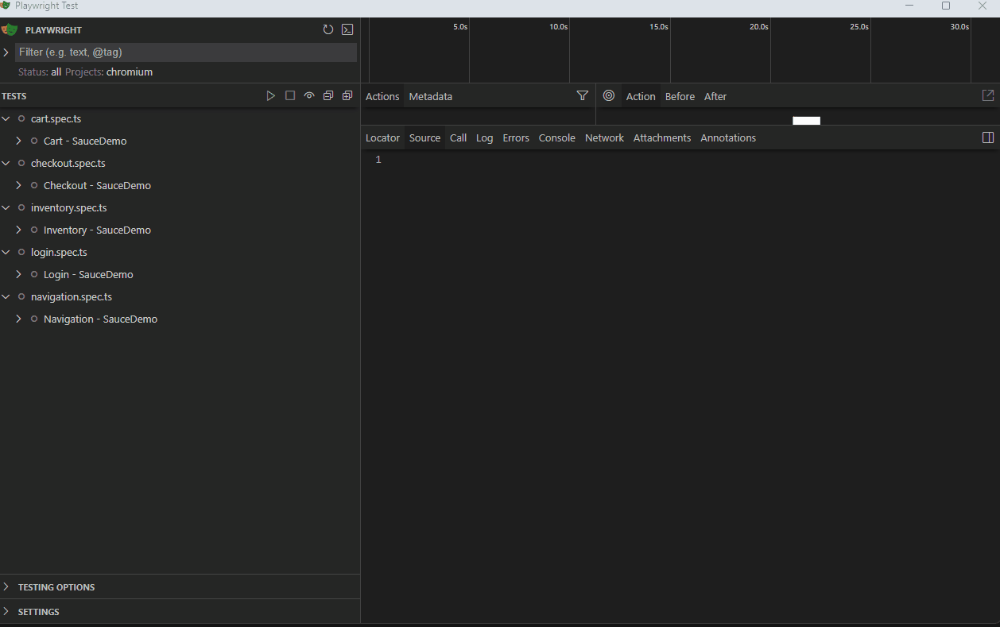
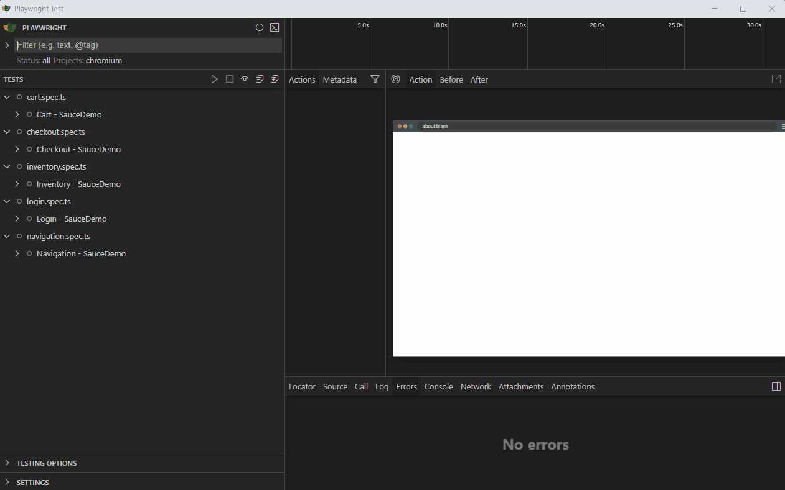

# Playwright E2E Automation Portfolio
E2E Automation testing portfolio using Playwright, TypeScript with Page Object Model. Test suite for Sauce e-commerce: login flows, shopping cart, checkout process, error handling, and cross-browser. Includes CI/CD with GitHub Actions and HTML reports. Tech Stack: Playwright | TypeScript | POM | GitHub Actions. Demo: https://www.saucedemo.com/

## Installation
- Ensure Node.js and npm are installed.
- Install project dependencies: `npm install`
- Install Playwright browsers: `npx playwright install`

## Technologies Used
- TypeScript
- Playwright
- Node.js

## Project Structure
```
portfolio-playwright-typescript-e2e-tests-pageObjetModel-saucedemo/
├─ tests/
│  ├─ cart.spec.ts
│  ├─ checkout.spec.ts
│  ├─ inventory.spec.ts
│  ├─ login.spec.ts
│  └─ navigation.spec.ts
├─ page-objects/
│  ├─ modules/
│  │  ├─ auth/
│  │  ├─ cart/
│  │  ├─ checkout/
│  │  ├─ inventory/
│  │  ├─ navigation/
│  │  └─ product/
│  └─ pageManager.ts
├─ test-data/
│  └─ loginData.ts
├─ playwright.config.ts
├─ package.json
└─ README.md
```
## Automated test execution with Playwright
- Cross-browser execution in Chromium and Firefox from VS Code
- Headless execution via Playwright CLI with HTML reporting


## Automated test execution with VS


## Playwright in Action single test demo
- In this demo, the test successful login with valid credentials runs to validate the login flow with valid credentials and confirms access to the inventory page.


## Running Tests
Run all tests:
```
npx playwright test
```

Shortcut using npm:
```
npm run test
```

Run tests in headed mode:
```
npm run test:headed
```

Run tests by tag:
```
npm run test:grep -- "@smoke"
```

Run tests by browser project:
```
npm run test:project -- chromium
```

## Reporting
Generate and open the HTML report:
```
npx playwright show-report
```

## Continuous Integration
This project uses GitHub Actions for continuous integration. The workflow is defined in `.github/workflows/playwright.yml`.
The CI pipeline runs on pushes to main/master branches and on pull requests.

## Contributing
1. Fork the repository
2. Create a new branch
3. Make your changes
4. Submit a pull request
